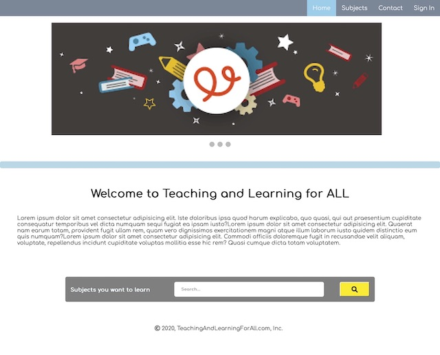
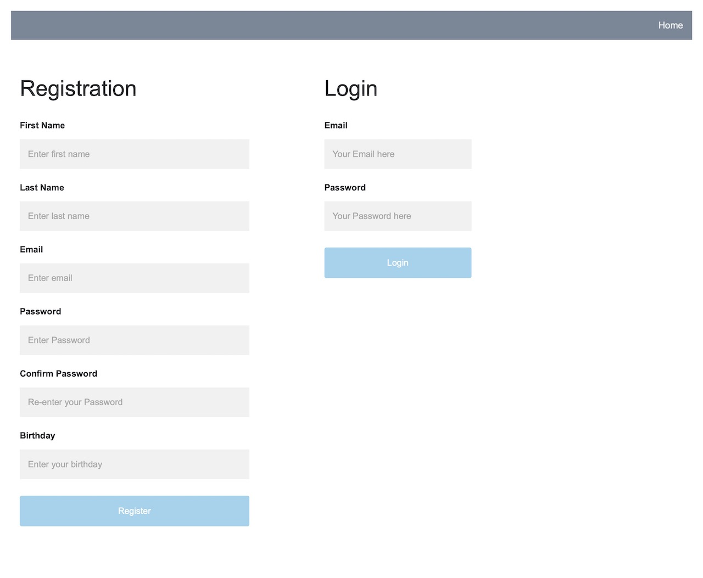

# Welcome to TutorNow application

It is an application particularly designed for users to exchange subjects on various subjects. Users can create private accounts and register for classes. 

Application consists of 6 pages: 
+ HOME 
+ SUBJECT
+ LOGIN / REGISTRATION
+ ACCOUNT
+ BLOG
+ CONTACT 

Home Page carousel image one

Home Page carousel image two

Home Page carousel image three

After searching the subjects user lands on recommended subjects' page to sign up for classes. 

The login and registration page is secured with BCrypt and has a HASHed password feature to protect user's information. It also performs validation to avoid incorrect data entry.
