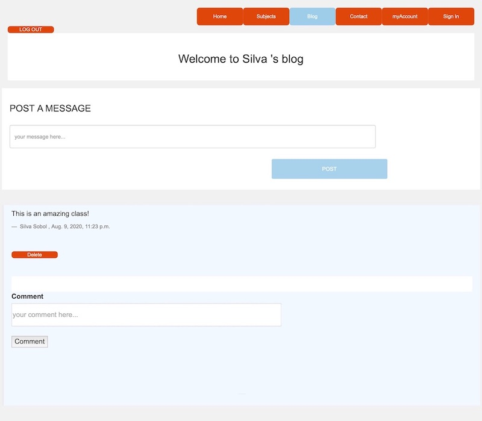

# Welcome to TutorNow application

It is an application particularly designed for users to tutor/exchange classes on various subjects. Users can create private accounts and register for classes. 

Application consists of 6 pages: 
+ HOME 
+ SUBJECT
+ LOGIN / REGISTRATION
+ ACCOUNT
+ BLOG
+ CONTACT 

###Home Page carousel image one

###Home Page carousel image two

###Home Page carousel image three

After searching the subjects user lands on recommended subjects' page to sign up for classes. 

The login and registration page is secured with BCrypt and has a HASHed password feature to protect user's information. It also performs validation to avoid incorrect data entry.

Account page displays user's account information and let's user create classes they would tutor. 

The Blog page is created to help users interact and exchange messages.

The contact page has business contact information along with embedded GOOGLE MAP API for location search and directions. 
 

